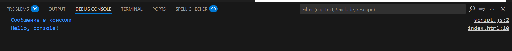

>#### Первым делом, открываю  `DevTools` в браузере и нажмимаю `F12`, и выберираю вкладку `Консоль`:


>#### Следующим этапом будет - выполнение кода `JavaScript` в открытой `Консоли`. Будут выполнены такие действия, как сложение двух чисел и вывод на консоль "Hellow, world!":


#### Далее создаю файл `index.html` и вставляю в него следующий код:
  ```html
   <!DOCTYPE html>
   <html lang="en">
     <head>
       <title>Привет, мир!</title>
     </head>
     <body>
       <script>
         alert("Привет, мир!");
         console.log("Hello, console!");
       </script>
     </body>
   </html>
   ```
   - Используется  встроеный скрипт в HTML (тег "script ")

>Результат кода на странице:


- Наблюдаем всплывающее окно alert(), сразу после загрузки страницы.


>#### Далее по заданию надо создать `JavaScript-файл`


#### Далее идёт подключение `JavaScript-файл` к `HTML-файлу` через внешний файл. 
- Подключите файл в `index.html`, добавив в `<head>`:
```html
   <script src="script.js"></script>
```
#### В файл script.js добавляем код:
```javascript
   alert("Этот код выполнен из внешнего файла!");
   console.log("Сообщение в консоли");
```
#### Открыв страницу в браузере, мы видим следующее:

- Наблюдаем всплывающее окно alert(), сразу после загрузки страницы но уже с другим текстом. После нажатия "ОК" снова видим текст "Привет, мир!"

#### Есть замечание,что команды: `console.log("Hello, console!"); и console.log("Сообщение в консоли");` выводит содержимое в скобках в консоль



