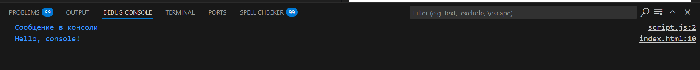
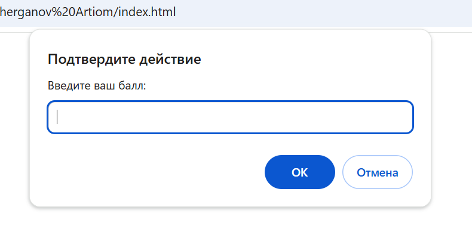

>#### Первым делом, открываю  `DevTools` в браузере и нажмимаю `F12`, и выберираю вкладку `Консоль`:


>#### Следующим этапом будет - выполнение кода `JavaScript` в открытой `Консоли`. Будут выполнены такие действия, как сложение двух чисел и вывод на консоль "Hellow, world!":


#### Далее создаю файл `index.html` и вставляю в него следующий код:
  ```html
   <!DOCTYPE html>
   <html lang="en">
     <head>
       <title>Привет, мир!</title>
     </head>
     <body>
       <script>
         alert("Привет, мир!");
         console.log("Hello, console!");
       </script>
     </body>
   </html>
   ```
   - Используется  встроеный скрипт в HTML (тег "script ")

>Результат кода на странице:


- Наблюдаем всплывающее окно alert(), сразу после загрузки страницы.


>#### Далее по заданию надо создать `JavaScript-файл`


#### Далее идёт подключение `JavaScript-файл` к `HTML-файлу` через внешний файл. 
- Подключите файл в `index.html`, добавив в `<head>`:
```html
   <script src="script.js"></script>
```
#### В файл script.js добавляем код:
```javascript
   alert("Этот код выполнен из внешнего файла!");
   console.log("Сообщение в консоли");
```
#### Открыв страницу в браузере, мы видим следующее:

- Наблюдаем всплывающее окно alert(), сразу после загрузки страницы но уже с другим текстом. После нажатия "ОК" снова видим текст "Привет, мир!"

#### Есть замечание,что команды: `console.log("Hello, console!"); и console.log("Сообщение в консоли");` выводит содержимое в скобках в консоль



>#### Начало выполнения 2 задания

Объявление переменных и работа с типами данных.

   - В файле `script.js` создайте несколько переменных:

     - `name` - строка с вашим именем.
     - `birthYear` - число, представляющее год вашего рождения.
     - `isStudent` - логическая переменная, указывающая, являетесь ли вы студентом.

     

>#### Результат в консоли:


>#### 2.Управление потоком выполнения (условия и циклы)

- в script.js пишем данный код :


>####  Как же работают условия и циклы? 
- Этот код сначала проверяет значение переменной `score` с помощью условий:  

1. **Если `score` 90 или больше**, программа выводит `"Отлично!"`.  
2. **Если `score` от 70 до 89**, выводится `"Хорошо"`.  
3. **Если `score` меньше 70**, выводится `"Можно лучше!"`.  

После этого идёт **цикл**:  

- Он **начинает** с числа 1 и **увеличивает его на 1** в каждой итерации.  
- Цикл **повторяется 5 раз** (до 5 включительно).  
- В каждой итерации программа выводит текущий номер (`Итерация: 1`, `Итерация: 2` и так далее).  
- Когда число доходит до 6, цикл **останавливается**.

#### Результаты на странице и в консоли :
 
 - В первую очередь, заходим на страницу и видим всплывающее окно с надписью "Введите ваш балл:"

 

 #### Далее я ввёл в поле число 89, перехожу в консоль: 

 - При вводе числа 89, программа сначала проверит условия:  

1. Оно не больше или равно 90, поэтому первый вариант не сработает.  
2. Оно больше или равно 70, поэтому программа выведет "Хорошо".  

Затем программа запустит цикл, который выполнится 5 раз. Каждый раз будет выводиться текст с номером итерации от 1 до 5.

 


